# INSTAL·LACIÓ OWNCLOUD

## Guia instal·lació Owncloud

### Què és Owncloud?

OwnCloud és una aplicació de programari lliure del tipus Servei d'allotjament d'arxius, que permet l'emmagatzematge en línia i aplicacions en línia.

### Requeriments:

Els requeriments que necessitem per instal·lar l'OwnCloud són:

- Linux: Ubuntu 22.04 LTS
- Servidor Web: Apache
- Base de Dades: MariaDB
- PHP versió: 7.3 o 7.4

### Instal·lació:

#### Instal·lació Apache:

1. El primer pas que farem per poder realitzar l'instal·lació de l'OwnCloud serà obrir el terminal, i un cop obert el terminal començarem instal·lant el servidor *apache*. 

```
sudo apt install apache2
```


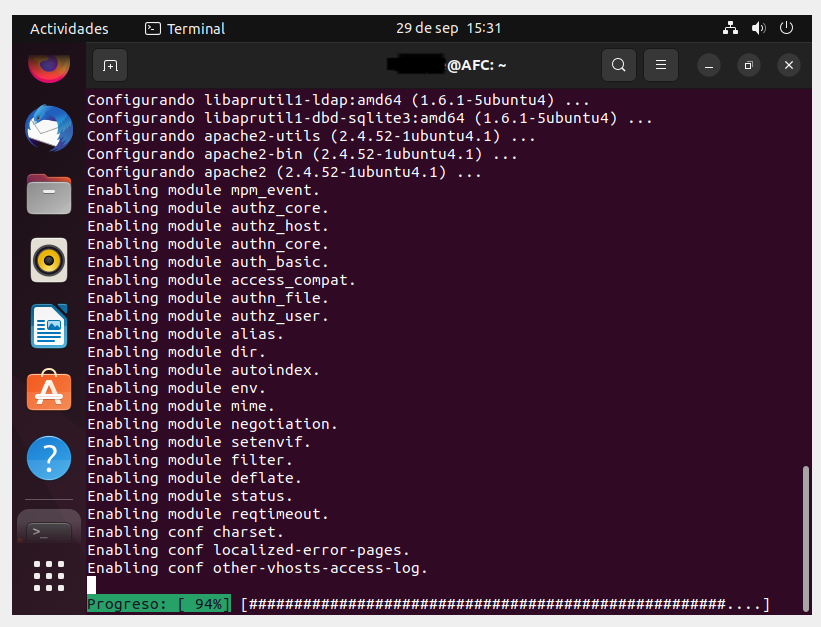

2. Ara el que farem serà mirar l'estat del servidor.

```
service apache2 status
```


3. Un cop mirat l'estat entrarem al següent directori: /var/www/html

```
cd /var/www/html
```

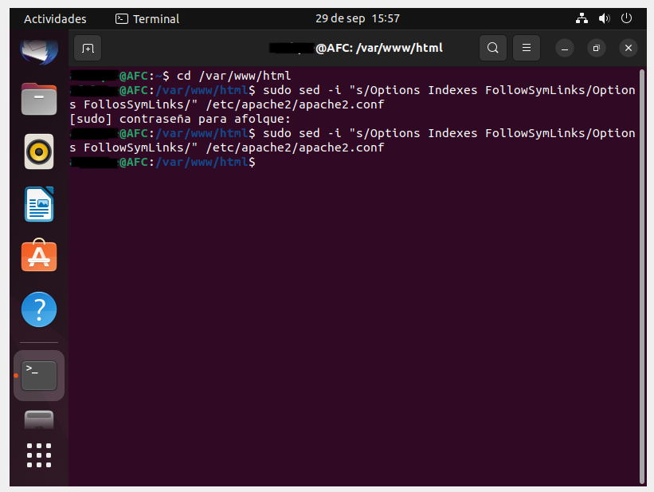

4. Un cop hem entrat al directori, el següent que farem serà desactivar el llistat de directoris del servidor. 

```
sudo sed -i "s/Options Indexes FollowSymLinks/Options FollowSymLinks/" /etc/apache2/apache2.conf
```


#### Instal·lar MariaDB:

1. El següent pas que farem un cop instal·lat l'apache serà instal·lar MariaDB.

```
sudo apt-get install mariadb-server mariadb-client -y
```

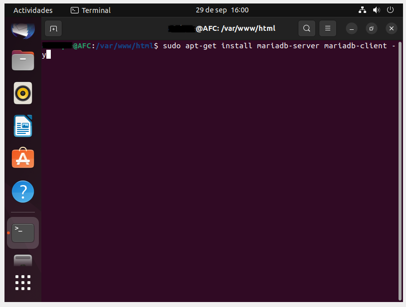


2. Un cop instal·lat, el que farem serà configurar la instal·lació.

```
sudo mysql_secure_installation
```


Aquí ens dirà si volem canviar l'autentificació del socket i li posarem "n"


El següent que ens dira serà si volem canviar la contrasenya del root i posarem "n"


La pròxima pregunta serà si volem eliminar els usuaris anònims i posarem "y"


Ara el que farem serà desactivar que no permetessim l'inici de sessió de root de forma remota, posant "n"

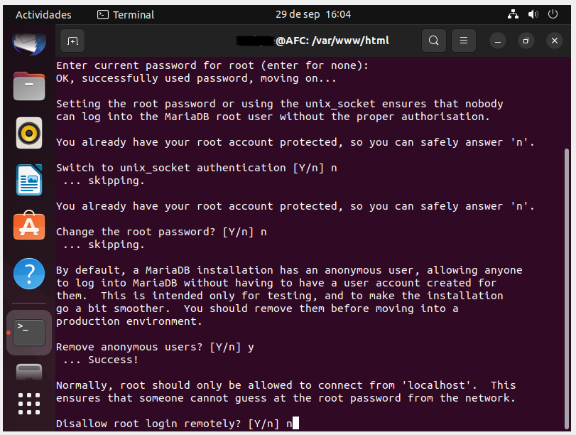

El següent que farem serà eliminar la base de dades de prova i accedir-hi, per poder eliminar-la i accedir posarem "y"

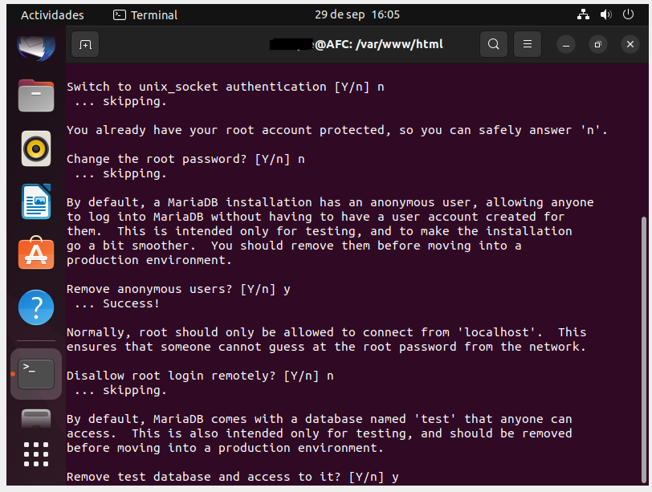

I per últim posarem "y" per així poder tornar a carregar les taules de privilegi ara

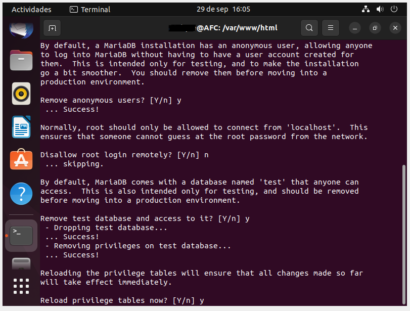

Un cop contestades les preguntes, ja tindrem la configuració realitzada!!

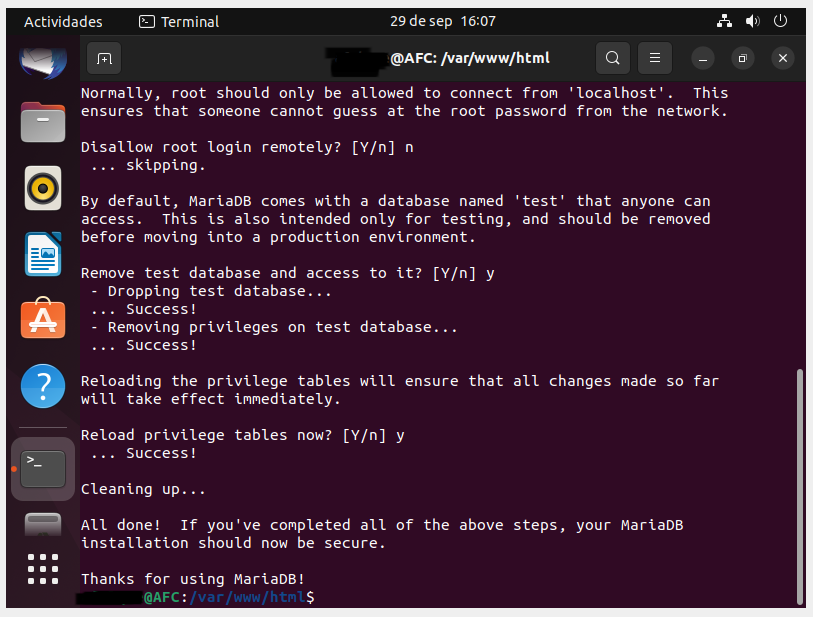

3. Per últim reiniciarem el servidor MariaDB.

```
sudo systemctl restart mariadb.service` o `sudo service mariadb.service restart
```

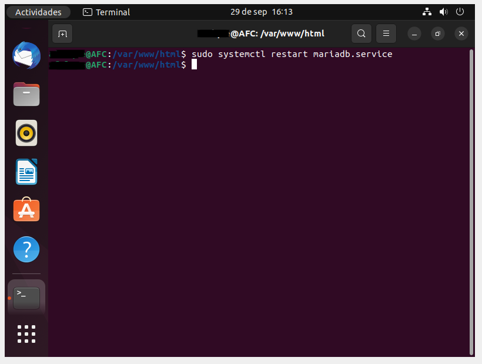

#### Creació de la Base de Dades de OwnCloud:

1. Entrarem a MariaDB

```
sudo mysql -u root -p
```


Un cop dintre, el que farem serà crear la base de dades.

```
CREATE DATABASE owncloud;
```


Un cop creada la base de dades, crearem l'usuari amb el nom *ownclouduser* i li assignarem la contrasenya *Admin1234*.

```
CREATE USER 'ownclouduser'@'localhost' IDENTIFIED BY 'Admin1234';
```


Un cop fet això, el que farem serà donar-li accés a l'usuari a la base de dades creada. 

```
GRANT ALL ON owncloud.* TO 'ownclouduser'@'localhost' IDENTIFIED BY 'Admin1234' WITH GRANT OPTION;
```

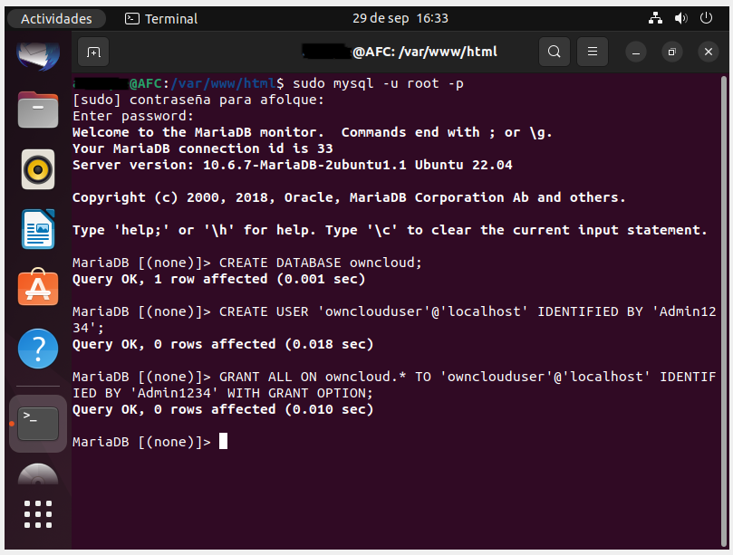

Aplicarem els canvis i sortirem.

```
FLUSH PRIVILEGES;
EXIT;
```

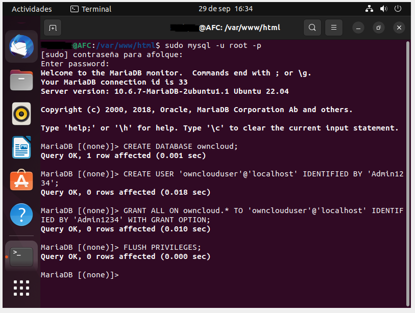


#### Instal·lar PHP i els modúls necessaris:

1. El primer que farem serà posar les següents comandes, per instal·lar el software i afegir els repositoris.

```
sudo apt-get install software-properties-common -y
sudo add-apt-repository ppa:ondrej/php
```

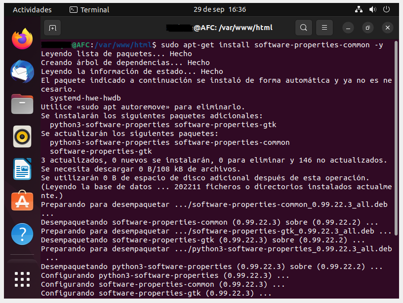


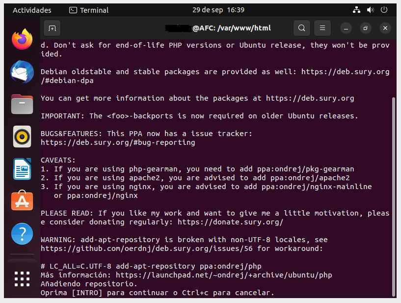

Com podem veure a l'última captura, a la fila de baix de tot ens dir que cliquessim INTRO o Crtl+C per a cancelar-ho, nosaltres clicarem INTRO.


2. Actualitzarem els paquets del repositori afegit. 

```
sudo apt update
```


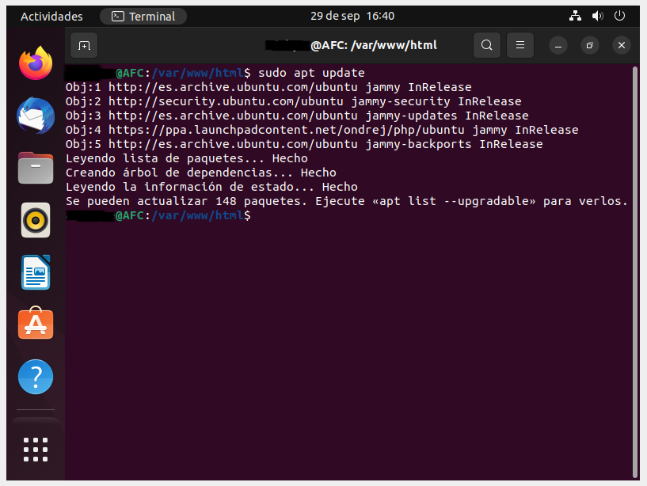

3. Un cop fet això, el que farem serà instal·lar el PHP i els móduls necessaris.

```
sudo apt install php7.4 libapache2-mod-php7.4 php7.4-common php7.4-mbstring php7.4-xmlrpc php7.4-soap php7.4-apcu php7.4-smbclient php7.4-ldap php7.4-redis php7.4-gd php7.4-xml php7.4-intl php7.4-json php7.4-imagick php7.4-mysql php7.4-cli php7.4-mcrypt php7.4-ldap php7.4-zip php7.4-curl -y
```
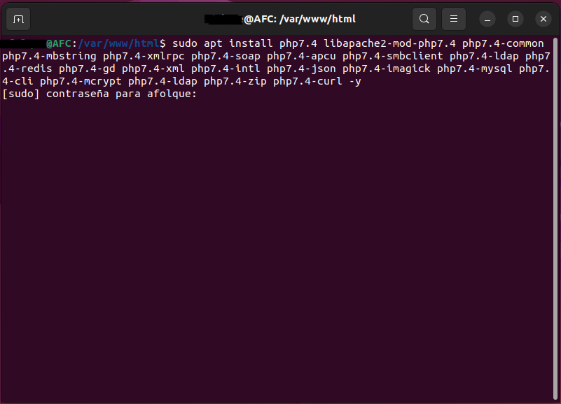
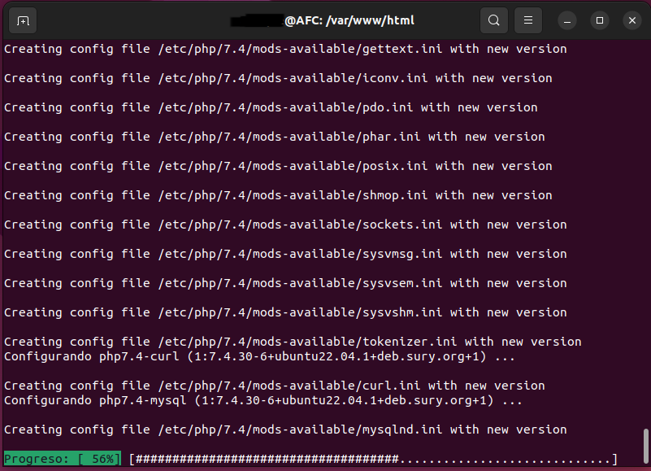

4. Després de l'instal·lació, el que farem serà editar el fitxer php.ini i canviarem el valor de memory_limit de 128M a 256M i el upload_max_filesize de 2M a 100M.

```
sudo gedit /etc/php/7.4/apache2/php.ini
```


####Instal·lació Owncloud

1. El primer que farem serà posar aquesta comanda, per així instal·lar el Owncloud.

```
cd /tmp && wget https://download.owncloud.com/server/stable/owncloud-complete-latest.zip
unzip owncloud-complete-latest.zip
```


2. Un cop instal·lat el mourem a /var/www/html/owncloud/

```
sudo mv owncloud /var/www/html/owncloud/
```


3. Un cop l'hem mogut, canviarem el propietari i els permisos dels directori d'owncloud. Per fer-ho utilitzarem aquestes dos comandes.

```
sudo chown -R www-data:www-data /var/www/html/owncloud/
```
```
sudo chmod -R 755 /var/www/html/owncloud/
```


#### Configuració Apache

1. El primer que farem serà configurar l'Apache, Utilitzarem la següent comanda.

```
sudo nano /etc/apache2/sites-available/owncloud.conf
```


2. Un cop configurat el que farem sera habilitar l'Owncloud i el módul rewrite amb les següents comandes. 

```
sudo a2ensite owncloud.conf
```
```
sudo a2enmod rewrite
```
```
sudo a2enmod headers
```
```
sudo a2enmod env
```
```
sudo a2enmod dir
```
```
sudo a2enmod mime
```


3. Un cop habilitat el reiniciarem.

```
sudo service Apache2 restart
```


Un cop fet això ja podrem configurar l'Owncloud.


