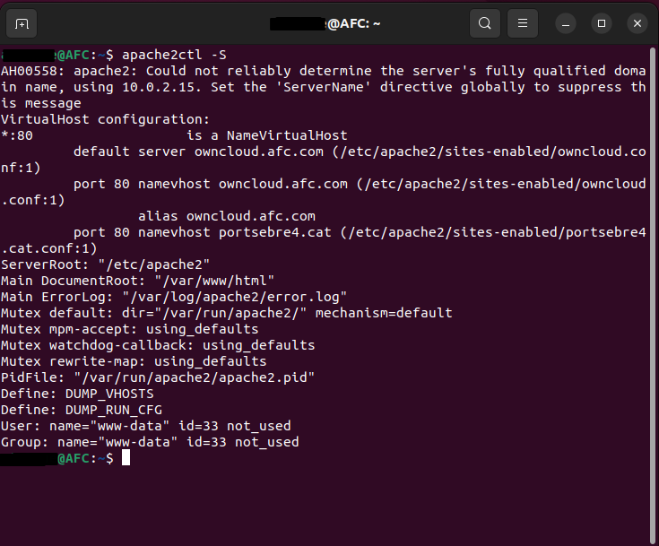
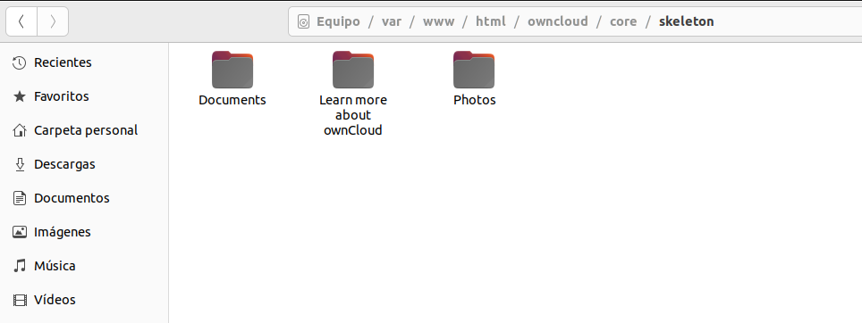
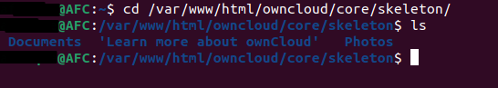
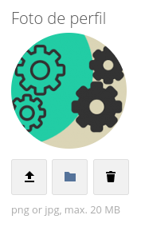
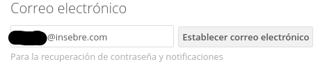
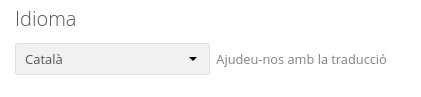
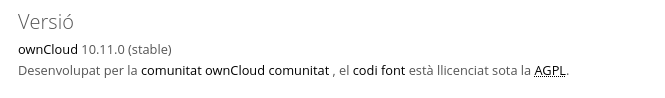

# Activitat 3:

Per fer aquesta activitat comptem amb que **ja s'ha configurat el servei Owncloud a una Màquina Virtual** (MV).

**3.1.-** Llista els Virtual Hosts d'Apache per tal de veure si **owncloud.XYZ.com** està habilitat amb la comanda:

```
apache2ctl -S
```  



**3.2.-** A Owncloud podem veure que hi ha una serie de carpetes per defecte, mostra la ruta real a les tres carpetes dins de la teva MV.





**RESPOSTA**

**3.3.-** Al directori **Learn more about owncloud** hi ha informació en forma de fitxers pdf. Consulta'ls i respon aquestes preguntes:

- Quin són els tres tipus de protecció de dades que ofereix Owncloud?

    **Els tres tipus de protecció de dades que ofereix Owncloud són Encryption in transit, Encryption at Rest, End-to-End Encryption.**
    
- Fes una petita descripció de cada un d'ells.

    **Encryption in transit: És quan les dades xifrades estan actives, es mouen entre dispositius i xarxes com ara Internet, dins d'una empresa o es pengen al núvol.**
    
    **Encryption at Rest: Està dissenyat per evitar que l'atacant accedeixi a les dades no xifrades assegurant-se que les dades estiguin xifrades quan es troben al disc.**
    
    **End-to-End Encryption: És un mètode de comunicació segura que impedeix que tercers accedeixin a les dades mentre es transfereixen d'un sistema o dispositiu final a un altre.**
    
- Per quina raó ens recomana utilitzar Owncloud per als documents de Microsoft Office de la nostra empresa?  
    **La raó per la que se'ns recomana utilitzar Ownloud és perquè emmagatzema tots els documents i correus elèctronics directament al núvol. Amb Owncloud i les seves aplicacions de Microsoft integrades, els empleats poden experimentar la productivitat total i la connectivitat perfecta sense arriscar-se a l'accés no autoritzat o a violacions de la protecció de dades, gràcies a un emmagatzematge de dades centralitzat al seu núvol privat.**
   
- Això passa a tots els països?

    **No passa a tots els països, ja que la llei nord-americana obliga a l'empresa a donar accés a les agències governamentals a les dades dels usuaris de Microsoft a petició.**
    
- Quina és la llicència d'OWncloud Enterprise?

    **Llicència comercial ownCloud per als mòduls empresarials.**
    
- I la d'Owncloud Standard?

    **AGPLv3 (Cal compartir les personalitzacions amb la comunitat).**
    
- Es poden veure videos en Streaming directament des de Owncloud?

    **Si que es poden veure videos en Streaming directament des de Owncloud.**
    
- Es poden connectar directoris de Google Drive a Owncloud?

    **Si que es poden connectar els directoris de Google Drive amb Owncloud.**
    
- I Dropbox?
    
    **Si que es pot connectar Dropbox amb Owncloud.** 
    
- Compta Owncloud amb antivirus? En cas afirmatiu com es diu? 

    **Si, el protocol és diu ClamAV.**


**3.4.-** Mostra els següents canvis de paràmetres d'usuari:

- Posa't una imatge d'usuari.

   
   
- Afegeix el teu mail de l'Institut.

   
   
- Canvia l'idioma a català.

   
   
- Mostra la versió d'Owncloud instal·lada.

   


